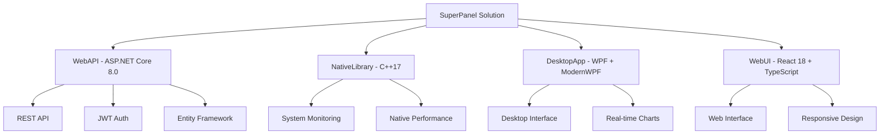

# SuperPanel - Web Host Control Panel

## Project Summary

**SuperPanel** is a comprehensive web hosting control panel built with modern technologies across multiple programming languages (C#, C++, JavaScript/TypeScript). It provides both desktop and web interfaces for managing web hosting services, servers, domains, and files.

## 🏗️ Architecture Overview



## 🚀 Key Features

### Core Functionality

- **Server Management**: Monitor system resources, manage server configurations
- **Domain Management**: Add, configure, and manage hosted domains with SSL integration
- **Email Management**: Complete email hosting with accounts, forwarders, and aliases
- **SSL Certificate Management**: Let's Encrypt integration and certificate lifecycle
- **File Management**: Web-based file explorer with upload/download capabilities
- **Database Management**: Create and manage databases and users
- **System Monitoring**: Real-time performance metrics via native C++ library

### User Interfaces

- **Desktop App**: Native Windows WPF application with dark theme
- **Web Interface**: Responsive React SPA with modern Ant Design components
- **REST API**: Comprehensive API with Swagger documentation

### Technical Features

- **JWT Authentication**: Secure token-based authentication with role-based access
- **Entity Framework Core**: Code-first database approach with migrations
- **Real-time Updates**: Live system monitoring and notifications via SignalR
- **Cross-platform**: API supports Windows and Linux deployment
- **Docker Support**: Complete containerized deployment with multi-service orchestration

## 📦 Technology Stack

### Backend

- **ASP.NET Core 8.0**: Web API framework
- **Entity Framework Core**: ORM for database operations
- **SQL Server**: Primary database (LocalDB for development)
- **JWT**: Authentication and authorization
- **Swagger/OpenAPI**: API documentation

### Native Components

- **C++17**: System monitoring library
- **Windows API**: System resource monitoring
- **P/Invoke**: .NET to native interop

### Desktop Application

- **WPF**: Windows Presentation Foundation
- **ModernWPF**: Modern UI theme library
- **MVVM Pattern**: Model-View-ViewModel architecture
- **Dependency Injection**: Microsoft.Extensions.DependencyInjection

### Web Interface

- **React 18**: Modern JavaScript framework
- **TypeScript**: Type-safe JavaScript
- **Vite**: Fast build tool and dev server
- **Ant Design**: Professional UI component library
- **React Query**: Data fetching and caching
- **React Router**: Client-side routing

### Development & Deployment

- **Docker**: Containerization support
- **Docker Compose**: Multi-service orchestration
- **Visual Studio 2022**: Primary IDE
- **VS Code**: Alternative development environment

## 🛠️ Quick Start

### Prerequisites

- Visual Studio 2022 with .NET 8.0 and C++ workloads
- Node.js 18.x or later
- SQL Server (LocalDB minimum)

### Build & Run

```bash
# 1. Build everything
./build.sh          # Linux/Mac
# or
build.bat           # Windows

# 2. Start with Docker
docker-compose up

# 3. Or run components individually

```bash
cd src/WebAPI && dotnet run                    # API: https://localhost:7001
cd src/DesktopApp && dotnet run               # Desktop App
cd src/WebUI && npm install && npm run dev    # Web UI: http://localhost:3000
```

## 📁 Project Structure

```text
getsuperpanel/
│
├── SuperPanel.sln                      # Visual Studio solution
│
├── src/
│   ├── WebAPI/                         # ASP.NET Core Web API
│   │   ├── Controllers/                # API endpoints
│   │   ├── Services/                   # Business logic
│   │   ├── Models/                    # Data models
│   │   ├── Data/                      # Entity Framework
│   │   └── Program.cs                 # Application entry
│   │
│   ├── NativeLibrary/                  # C++ system monitoring
│   │   ├── SystemMonitor.h/cpp         # Native functions
│   │   └── dllmain.cpp                 # DLL entry point
│   │
│   ├── DesktopApp/                     # WPF desktop application
│   │   ├── Views/                      # XAML user interfaces
│   │   ├── ViewModels/                 # MVVM view models
│   │   └── Services/                   # Application services
│   │
│   └── WebUI/                          # React web interface
│       ├── src/components/             # React components
│       ├── src/pages/                  # Page components
│       └── src/services/               # API client
│
├── docs/
│   ├── README.md                       # Main documentation
│   ├── DEVELOPMENT.md                  # Development guide
│   └── API.md                          # API documentation
│
├── build.sh / build.bat                # Build scripts
├── docker-compose.yml                  # Docker orchestration
└── Dockerfile                          # API container definition
```

## 🔧 Development Workflow

1. **Setup**: Install prerequisites and clone repository
2. **Database**: Run Entity Framework migrations
3. **Native Library**: Build C++ components first
4. **API**: Start the ASP.NET Core backend
5. **Frontend**: Choose desktop app or web interface
6. **Testing**: Use Swagger for API testing

## 🌟 Highlights

- **Multi-Language Integration**: Seamless C#, C++, and TypeScript integration
- **Modern UI/UX**: Both desktop and web interfaces with consistent design
- **Production Ready**: Docker support, authentication, and comprehensive error handling
- **Extensible**: Modular architecture allows easy feature additions
- **Cross-Platform**: API and web UI support Windows, Linux, and macOS

## 📝 Next Steps

1. **Compile & Test**: Run build scripts to compile all components
2. **Configure Database**: Set up SQL Server connection strings
3. **Install Dependencies**: Run `npm install` in WebUI directory
4. **Deploy**: Use Docker for easy deployment or individual component hosting
5. **Customize**: Extend functionality based on specific hosting needs

---

**SuperPanel** provides a solid foundation for web hosting management with modern development practices and technologies. The multi-language approach leverages the strengths of each platform while maintaining clean separation of concerns and maintainable code architecture.
